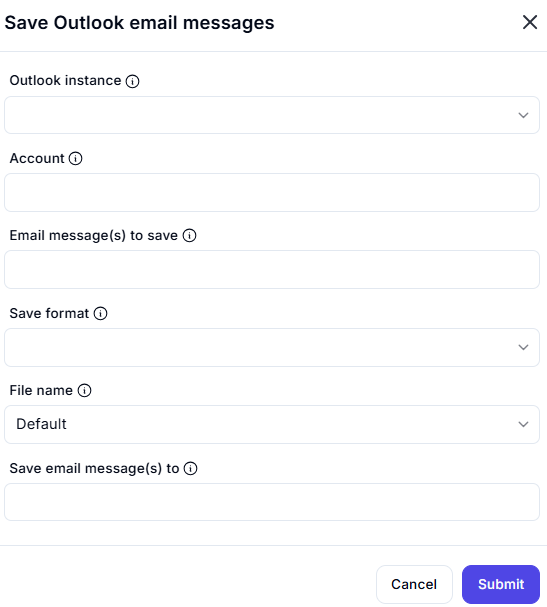

# Save Outlook Email Messages  

## Description

This feature allows users to save Outlook email messages in a specified format and location. It is useful for archiving or exporting emails for further use or analysis.  

  

## Fields and Options  

### 1. **Email Message(s) to Save** 🛈

- **Description**: Select the email messages to save.  
- **Purpose**: This ensures the correct emails are saved.  

### 2. **Save Format** 🛈

- **Description**: Choose the format in which to save the email messages (e.g., `.msg`, `.eml`, `.txt`).  
- **Purpose**: This ensures the emails are saved in the desired format.  

### 3. **File Name** 🛈

- **Description**: Specify the file name for the saved email messages.  
  - **Default**: Use a default naming convention.  
  - **Custom**: Enter a custom file name.  
- **Purpose**: This ensures the saved files are named appropriately.  

### 4. **Save Email Message(s) To** 🛈

- **Description**: Specify the folder or directory where the email messages will be saved.  
- **Purpose**: This ensures the emails are saved in the correct location.

## Use Cases

- **Email Archiving**: Saving emails for long-term storage or compliance purposes.  
- **Email Export**: Exporting emails for further analysis or sharing.  
- **Workflow Automation**: Integrating email saving into larger automation workflows.  

## Summary

The **Save Outlook Email Messages** action provides a way to save Outlook emails in a specified format and location. It ensures efficient email archiving and exporting, making it ideal for automation workflows involving Outlook.
