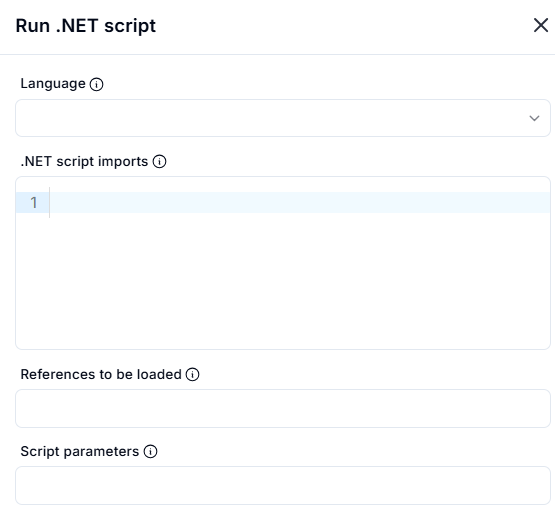
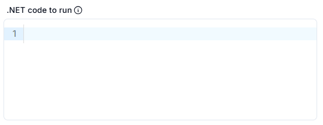

# Run .NET Script

## Description

This section allows users to execute .NET scripts with customizable settings.

### **1. Language**

- Dropdown selection for choosing the .NET scripting language (e.g., C#, F#, VB.NET).

### **2. .NET Script Imports**

- Area for specifying necessary namespaces and libraries to be imported.

### **3. References to be Loaded**

- Input field for listing additional assemblies or references required for script execution.

### **4. Script Parameters**

- Field to enter parameters that should be passed to the script at runtime.

## .NET Code Execution

This section allows users to enter and run .NET code.

### **.NET Code to Run**

- A text editor where users can input the .NET script they want to execute.

The script will be processed based on the selected language and provided configurations.
