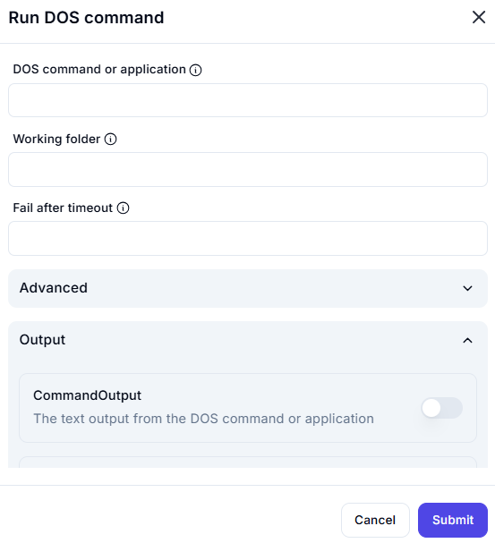

# **Run DOS Command**

## Description

This interface allows users to execute a **DOS command or application** within a specified working directory.

## **Fields**

### **1. DOS Command or Application**

- Enter the command or application to run.
- Example: `dir`, `ping google.com`, `ipconfig`.

### **2. Working Folder** *(Optional)*

- Specify the folder where the command should execute.
- Example: `C:\Users\Username\Documents`.

### **3. Fail After Timeout** *(Optional)*

- Set a timeout in seconds, after which the command will be terminated if it hasn't completed.

## **Advanced Options**

- Additional settings can be configured under the **Advanced** section.

## **Output**

- **CommandOutput** *(Toggle)*
  - If enabled, captures and stores the command's text output.

### **⚠ Warning**

- Running certain **commands** (e.g., `del`, `format`, `shutdown`) may affect system files and stability.
- Ensure proper **permissions** for administrative commands.
