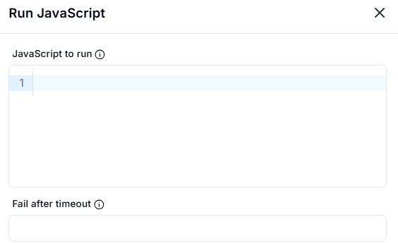
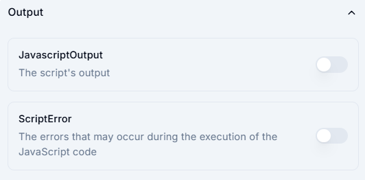

# Run JavaScript

This section allows users to execute JavaScript code.

## Input Fields

1. **JavaScript to run**  
   - A text box to enter the JavaScript code to be executed.

2. **Fail after timeout**  
   - An optional field to specify the timeout duration.  
   - If the script takes longer than this duration, execution fails.

## Output fields

### 1. JavascriptOutput

- Option to retrieve the script's output.

### 2. ScriptError

- Option to capture errors that may occur during the execution of the JavaScript code.

## Usage

- Enter the JavaScript code in the text box.
- (Optional) Set a timeout limit.
- Enable output options if needed.
- Click **Submit** to run the script.
