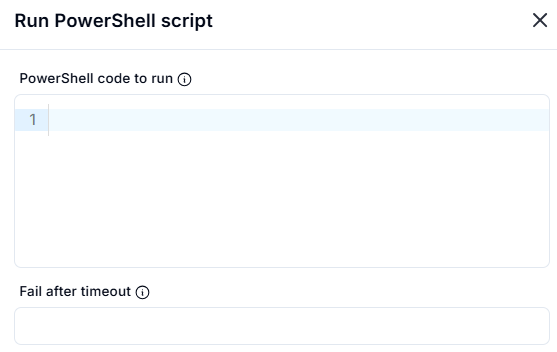
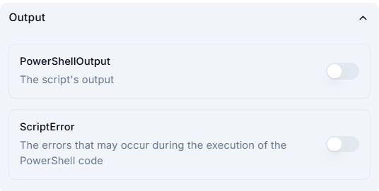

# Run PowerShell Script

This section allows users to execute PowerShell scripts.

## Fields

### 1. PowerShell code to run

- A text box to enter the PowerShell script that will be executed.

### 2. Fail after timeout

- An optional field to specify the timeout duration.  
- If the script takes longer than this duration, execution fails.

## Output

This section controls the output settings for the executed PowerShell script.

### 1. **PowerShellOutput**

- Toggle to enable or disable capturing the script's output.  
- If enabled, the script's output will be recorded.

### 2. **ScriptError**

- Toggle to enable or disable capturing errors during script execution.  
- If enabled, any errors encountered during execution will be recorded.

## Usage

- Enter the PowerShell script in the provided text box.
- (Optional) Set a timeout limit.
- Click **Submit** to execute the script.
