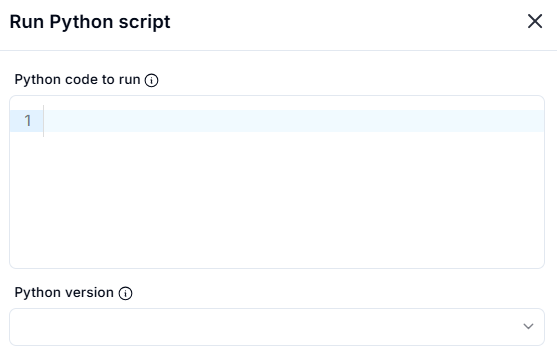
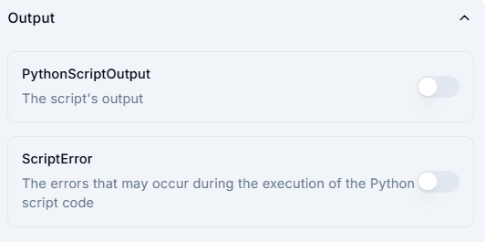

# Run Python Script

## Description

This section allows you to execute a Python script.

### 1. **Python Code to Run**

- Enter the Python code you wish to execute in the provided text area.

### 2. **Python Version**

- Select the appropriate Python version from the dropdown menu.

## Output

This section displays the output and errors generated by the executed Python script.

### 1. **PythonScriptOutput**

- Displays the output of the Python script.
- Toggle to enable or disable viewing the script’s output.

### 2. **ScriptError**

- Shows any errors that may occur during the execution of the Python script.
- Toggle to enable or disable viewing script errors.

## Usage

- Write or paste the Python code in the text box.
- Choose the Python version if necessary.
- Execute the script to get results.
