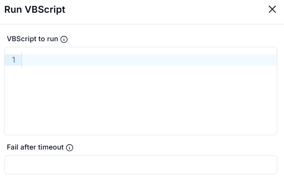
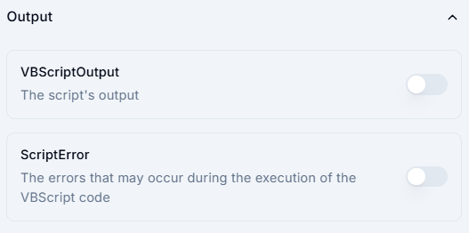

# **Run VBScript**

## Description

This interface allows users to execute a **VBScript** within a given environment.




## **Fields**

### **1. VBScript to Run**

- Enter the VBScript code directly into the text area.
- Example:

  ```vbscript
  MsgBox "Hello, World!"

The script should follow VBScript syntax and can include message boxes, file operations, or automation tasks.

### **2. Fail After Timeout (Optional)**

Set a timeout in seconds to terminate the script if it runs too long.

## **Output**

This section provides **two output toggles**:

## 1. VBScriptOutput

- Captures the **script's output** after execution.  
- Useful for scripts that return data or print messages.  

## 2. ScriptError

- Displays any **errors** encountered while running the VBScript.  
- Helps with **debugging** and troubleshooting script failures.  

## How to Use

- **Enable the toggles** to capture output or errors.  
- If unchecked, the script runs without logging output/errors.  
