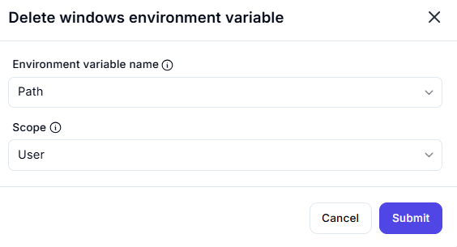

# **Delete Windows Environment Variable**

## Description

This interface allows users to **remove** a specified Windows environment variable.

## **Fields**

### **1. Environment Variable Name**

- Select the **name** of the environment variable to delete.
- Example: `ChocolateyLastPathUpdate`, `OneDrive`, `Path`, `TEMP`.

### **2. Scope**

- Choose the **scope** of the variable:
  - **User** – Deletes the variable from the current user’s environment.
  - **System** – Deletes the variable from the system-wide environment (Admin privileges required).

---

### **⚠ Warning**

- Deleting system environment variables can affect **applications** and **system stability**.
- Ensure **backups** are made before deletion.
