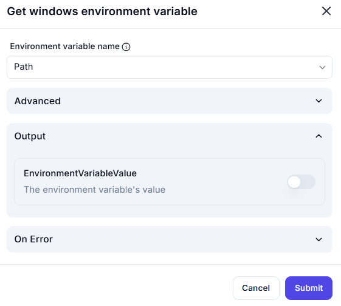

# **Get Windows Environment Variable**

## Description

This interface allows users to **retrieve** the value of a specified Windows environment variable.

## **Fields**

### **1. Environment Variable Name**

- Select the **name** of the environment variable to fetch.
- Example: `ChocolateyLastPathUpdate`, `OneDrive`, `Path`, `TEMP`

### **2. Advanced (Expandable Section)**

- Provides additional settings (if applicable).

### **3. Output**

- **EnvironmentVariableValue (Toggle Switch)** – Enable to store the retrieved value of the environment variable.

### **4. On Error (Expandable Section)**

- Define error-handling behavior.

---

### **Usage Example**

1. Select `Path` as the **Environment Variable Name**.
2. Enable **EnvironmentVariableValue** to capture the retrieved value.
3. Click **Submit** to fetch the value.

🔎 **Tip:** Use this to verify system variables before making modifications.
