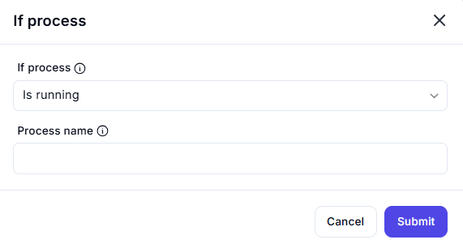

# If Process Action Interface

## Description

This interface checks if a specific process is running.

## **Fields & Descriptions**

### **1. If Process**

- Dropdown to choose the condition to check:
  - `Is running` → Checks if the process is active.
  - `Is not running` → Checks if the process is inactive.

### **2. Process Name**

- Specifies the name of the process to check.  
- **Example:** `chrome.exe`, `notepad.exe`

## **Use Cases**

✔ Automating actions based on process status  
✔ Checking if an application is running before execution  
✔ Stopping a process if it's consuming too many resources.
