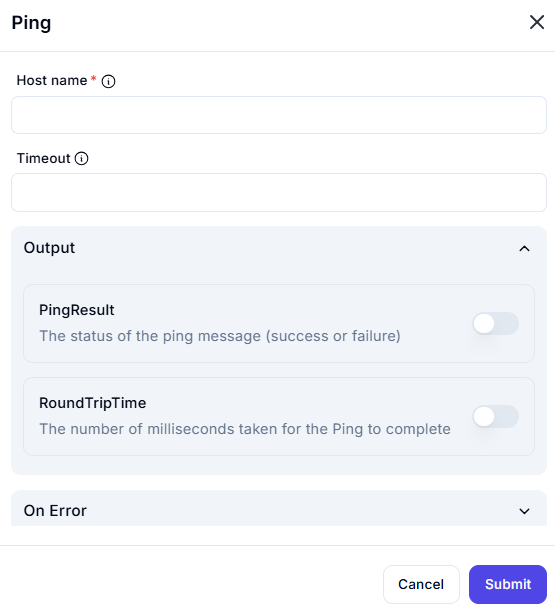

# **Ping**

This interface allows users to send a **ping request** to a specified host to check network connectivity and measure response time.

## **Fields**

### **1. Host Name** *(Required)*

- Enter the **domain name** or **IP address** of the target host.
- Example: `google.com` or `192.168.1.1`

### **2. Timeout** *(Optional)*

- Specify the maximum time (in milliseconds) to wait for a response.
- If left blank, a default timeout is used.

## **Output Options**

Enable these options to capture results:

### **1. PingResult** *(Toggle)*

- Returns **success** or **failure** based on whether the ping request received a response.

### **2. RoundTripTime** *(Toggle)*

- Records the **time (in milliseconds)** it took for the ping request to complete.

---

### **Usage Example**

1. Enter `google.com` in the **Host Name** field.
2. Set a timeout of `1000` milliseconds.
3. Enable **PingResult** and **RoundTripTime** toggles.
4. Click **Submit** to execute the ping test.
