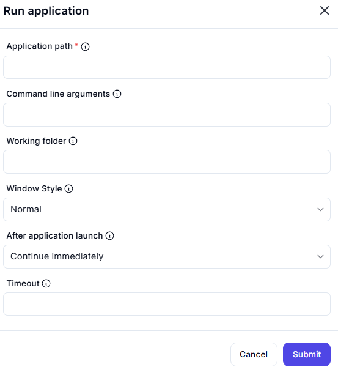
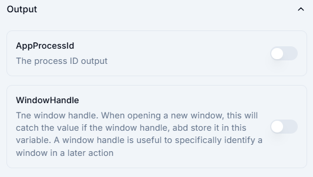

# Run Application

## Description

This interface allows users to execute an application with customizable options.

## **Fields & Descriptions**

### **1. Application Path** *(Required)*

- Specifies the full path of the application to run.
- **Example:** `C:\Program Files\Notepad++\notepad++.exe`

### **2. Command Line Arguments**

- Optional parameters to pass to the application.
- **Example:** `-file "C:\example.txt"`

### **3. Working Folder**

- The directory in which the application will be executed.

### **4. Window Style**

- Defines how the application window appears:
  - `Normal` (default)
  - `Minimized`
  - `Maximized`
  - `Hidden`

### **5. After Application Launch**

- Defines what happens after starting the application:
  - `Continue immediately`
  - `Wait for the application to exit`

### **6. Timeout**

- Maximum wait time (in seconds) before stopping execution.

## **Available Outputs**

### **1. AppProcessId** *(Toggle)*

- Captures the **Process ID (PID)** of the launched application.
- Useful for tracking or managing the application process later.

### **2. WindowHandle** *(Toggle)*

- Captures the **Window Handle** when opening a new window.
- Helps uniquely identify a window for later interactions.
- **Example Use Case:** Automating window management (minimize, maximize, close).

---

### **How It Works**

1. Enable the toggle switch for the required output.
2. The system will capture and store the value when the application launches.
3. The stored values can be used in later actions or scripts.

### **Use Cases**

- Launching applications with specific parameters  
- Automating tasks that require a particular program to start  
- Running batch scripts or command-line utilities  
