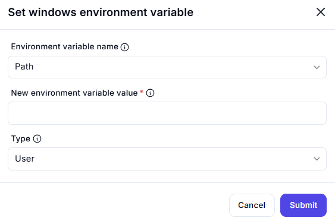

# **Set Windows Environment Variable**

This interface allows users to **set or modify** Windows environment variables.

## **Fields**

### **1. Environment Variable Name**

- Select the **name** of the environment variable to modify.
- Example: `ChocolateyLastPathUpdate`, `OneDrive`, `Path`, `TEMP`

### **2. New Environment Variable Value** *(Required)*

- Enter the **new value** to assign to the environment variable.
- Example: `C:\Program Files\MyApp`

### **3. Type**

- Choose the **scope** of the environment variable:
  - **User** – Applies only to the current user.
  - **System** – Applies globally to all users on the system.

---

### **Usage Example**

1. Select `Path` as the **Environment Variable Name**.
2. Enter `C:\NewPathDirectory` in the **New Environment Variable Value** field.
3. Set the **Type** to `User` or `System`.
4. Click **Submit** to apply the changes.

⚠ **Note:** Changing system variables may require **administrator privileges**.
