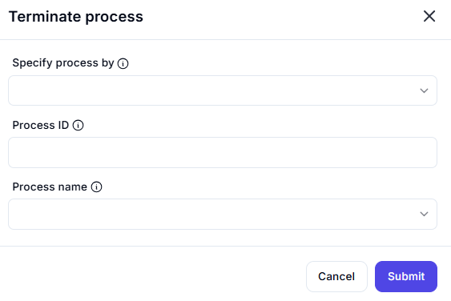

# **Terminate Process**

## Description

This interface allows users to stop a running process by specifying either the **Process ID (PID)** or **Process Name**.

## **Fields**

### **1. Specify process by** *(Dropdown)*

- Choose whether to terminate the process using:
  - **Process ID**
  - **Process Name**

### **2. Process ID** *(Input)*

- Enter the **numerical Process ID (PID)** of the process to be terminated.
- This is useful when you have the exact PID from a previous step.

### **3. Process Name** *(Dropdown)*

- Select the process by its **name** (e.g., `chrome.exe`, `notepad.exe`).
- Useful when terminating a known application.

---

### **Usage Example**

1. Choose **"Process Name"** from the dropdown.
2. Select `chrome.exe` to terminate all running instances of Google Chrome.
3. Click **Submit** to terminate the selected process.
