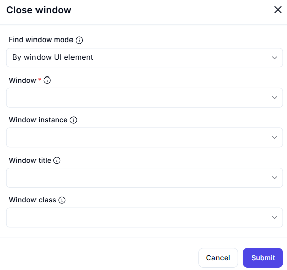

# Close Window  

## Description

This feature allows users to close a specific window by identifying it using various attributes such as UI element, title, or class. It is useful for automating window management tasks.  

  

## Fields and Options  

### 1. **Find Window Mode** 🛈

- **Description**: Choose how to identify the window to close:  
  - **By Window UI Element**: Identify the window using its UI element.  
  - **By Window Title**: Identify the window using its title.  
  - **By Window Class**: Identify the window using its class.  
- **Purpose**: This ensures the correct window is targeted for closing.  

### 2. **Window** 🛈

- **Description**: Specify the window to close using one of the following:  
  - **Window Instance**: Select the window instance.  
  - **Window Title**: Enter the window title.  
  - **Window Class**: Enter the window class.  
- **Purpose**: This ensures the correct window is identified.  

## Use Cases

- **Window Management**: Closing unnecessary or unused windows to free up system resources.  
- **Workflow Automation**: Automating window closing as part of larger workflows.  
- **System Cleanup**: Ensuring windows are properly closed after completing tasks.  

## Summary

The **Close Window** action provides a way to close a specific window by identifying it using attributes like UI element, title, or class. It ensures efficient window management, making it ideal for automation workflows involving window manipulation.  
