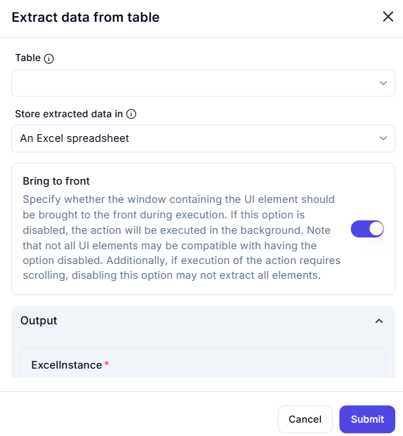

# Extract Data from Table

## Description  

The **Extract Data from Table** action retrieves data from a specified table within an application and stores it in an Excel spreadsheet.

## Fields and Options  

### **1. Table** *(Required)* 🛈  

- Select the **table** from which data should be extracted.

### **2. Store Extracted Data In** *(Required)* 🛈  

- Choose where the extracted data should be stored.  
- Available option:  
  - **An Excel spreadsheet** – Saves the retrieved table data in an Excel file.

### **3. Bring to Front** *(Optional)* 🛈  

- If enabled, the window containing the table will be brought to the front during execution.  
- If disabled, the action will execute in the background.  
- Some UI elements may not be accessible if this option is turned off.  
- If scrolling is required for extraction, disabling this option may impact accuracy.

### **4. Output Variable** *(ExcelInstance)*  

- Stores the extracted table data in an Excel instance.

## Use Cases  

- Extracting structured data from UI tables for further processing.  
- Automating data transfer from application tables to Excel.  
- Generating reports based on UI table contents.

## Important Notes  

- Ensure the correct table is selected for accurate data extraction.  
- Some tables may require scrolling to retrieve all data.  
- Bringing the window to the front improves reliability but may disrupt user activity.

## Summary  

The **Extract Data from Table** action enables users to retrieve and store structured data from UI tables efficiently, supporting automation and data processing workflows.
