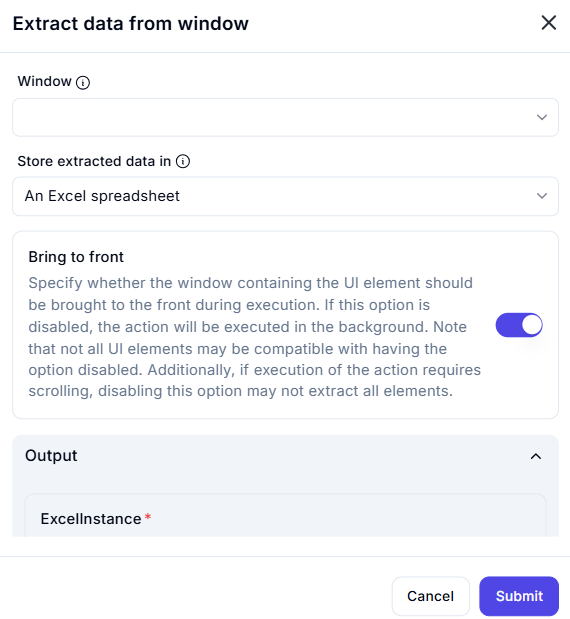

# Extract Data from Window

## Description  

The **Extract Data from Window** action retrieves data from a specified window and stores it in a structured format, such as an Excel spreadsheet.

## Fields and Options  

### **1. Window** *(Required)* 🛈  

- Select the **window** from which data should be extracted.

### **2. Store Extracted Data In** *(Required)* 🛈  

- Choose where the extracted data should be saved.  
- Available option:  
  - **An Excel spreadsheet** – Stores the retrieved data in an Excel file.

### **3. Bring to Front** *(Optional)* 🛈  

- If enabled, the window containing the UI element will be brought to the front during execution.  
- If disabled, the action will run in the background.  
- Some UI elements may not be accessible if this option is turned off.  
- If scrolling is required for extraction, disabling this option may affect accuracy.

### **4. Output Variable** *(ExcelInstance)*  

- Stores the extracted data in an Excel instance.

## Use Cases  

- Extracting structured data from application windows for analysis.  
- Automating data capture from UI elements into an Excel file.  
- Generating reports based on UI content.

## Important Notes  

- Ensure the correct window is selected for accurate data retrieval.  
- If data is dynamically loaded, ensure the window is fully loaded before execution.  
- Bringing the window to the front improves reliability but may disrupt user activity.

## Summary  

The **Extract Data from Window** action allows users to retrieve and store data from a UI window efficiently, automating data processing and extraction workflows.
