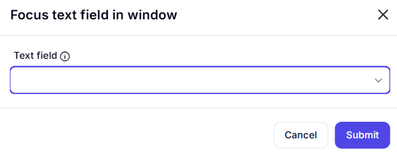
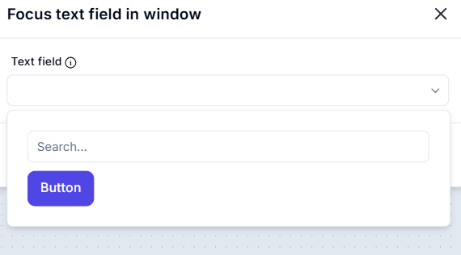

# Focus Text Field in Window  

## Description  

The **Focus Text Field in Window** action sets the focus to a specified text field within a window, ensuring that it is ready for input.  

  

## Fields and Options  

### **1. Text Field** *(Required)* 🛈  

- Select the **text field** that should receive focus.  

## Use Cases  

- Preparing a text field for automated data entry.  
- Ensuring the correct field is active before user input.  
- Avoiding manual clicks to activate a text field.  

## Important Notes  

- Ensure the target text field is visible and interactive.  
- Some UI elements may require additional actions to become focusable.  

## Summary  

The **Focus Text Field in Window** action helps automate workflows by ensuring the correct text field is active and ready for input, improving efficiency in UI-based automation.  
