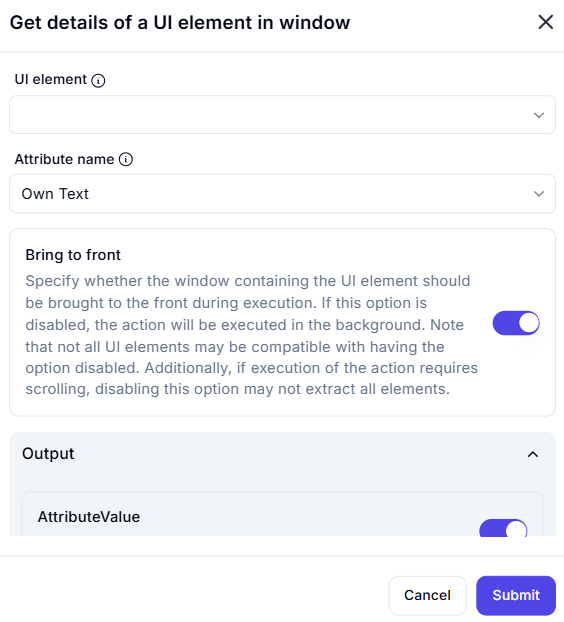

# Get Details of a UI Element in Window

## Description

The **Get Details of a UI Element in Window** action extracts specific attribute values from a UI element within an active window.

## Fields and Options  

### **1. UI Element** *(Required)* 🛈  

- Select the **UI element** from which the attribute should be retrieved.

### **2. Attribute Name** *(Required)* 🛈  

- Choose the specific **attribute** to extract.  
- Available options include:  
  - **Own Text** (Default) – Retrieves the text content of the element.  
  - Other attributes may be available depending on the UI framework.

### **3. Bring to Front** *(Optional)* 🛈  

- If enabled, the window containing the UI element will be brought to the front during execution.  
- If disabled, the action will run in the background.  
- Some UI elements may not be accessible if this option is turned off.  
- If scrolling is required for extraction, disabling this option may affect accuracy.

### **4. Output Variable** *(AttributeValue)*  

- Stores the retrieved attribute value in the specified variable.

## Use Cases  

- Extracting text from UI elements for validation or processing.  
- Retrieving UI element properties for automation workflows.  
- Checking visibility or state of UI elements before executing actions.

## Important Notes  

- Ensure the correct UI element is selected to avoid extraction errors.  
- If the UI element is not visible or interactable, some attributes may not be retrievable.  
- Bringing the window to the front ensures more reliable data extraction but may interrupt user activity.

## Summary  

The **Get Details of a UI Element in Window** action allows users to extract key attributes from a specified UI element, making it useful for UI automation tasks such as text retrieval, validation, and interaction tracking.
