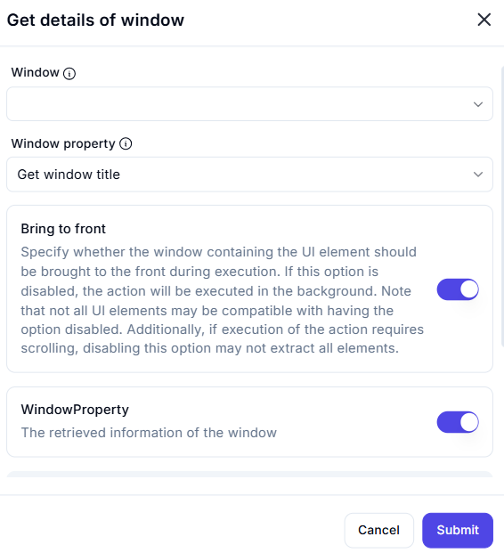

# Get Details of Window

## Description

The **Get Details of Window** action retrieves specific information about a selected window, such as its title or other properties.

## Fields and Options  

### **1. Window** *(Required)* 🛈  

- Select the target window from which details should be extracted.

### **2. Window Property** *(Required)* 🛈  

- Choose the specific **window property** to retrieve.  
- Available options include:  
  - **Get window title** (Default) – Retrieves the title of the window.  
  - Other window properties may be available depending on the system.  

### **3. Bring to Front** *(Optional)* 🛈  

- If enabled, the window will be brought to the foreground during execution.  
- If disabled, the action will run in the background.  
- Some UI elements may not be accessible if this option is turned off.  

### **4. Output Variable** *(WindowProperty)*  

- Stores the retrieved information about the window.  

## Use Cases  

- Identifying active windows in automation workflows.  
- Extracting application titles for monitoring purposes.  
- Checking window states before executing further actions.  

## Important Notes  

- If the target window is minimized or hidden, some properties may not be retrievable.  
- Bringing the window to the front ensures reliable data extraction but may interrupt user activity.  
- Ensure correct window selection to avoid errors in automation.  

## Summary  

The **Get Details of Window** action allows users to extract key properties from a specified window, making it useful for automation scenarios where window state or title information is required.
