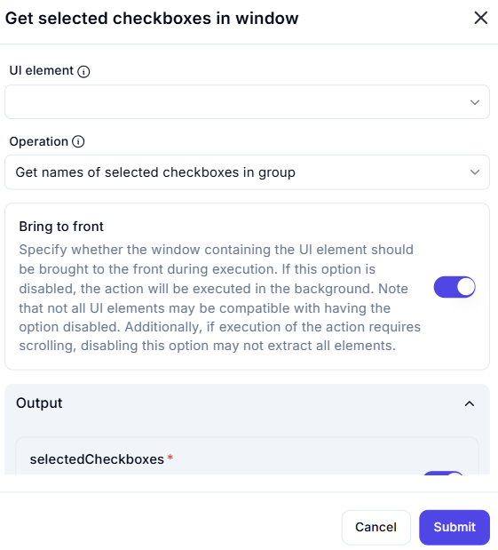

# Get Selected Checkboxes in Window

## Description  

The **Get Selected Checkboxes in Window** action retrieves the names of all checked checkboxes within a specified UI element.

## Fields and Options  

### **1. UI Element** *(Required)* 🛈  

- Select the **UI element** containing the checkboxes to be processed.

### **2. Operation** *(Required)* 🛈  

- Choose the action to perform on the checkboxes.
- Available option:  
  - **Get names of selected checkboxes in group** – Retrieves the names of all currently checked checkboxes.

### **3. Bring to Front** *(Optional)* 🛈  

- If enabled, the window containing the UI element will be brought to the front during execution.  
- If disabled, the action will run in the background.  
- Some UI elements may not be accessible if this option is turned off.  
- If scrolling is required for extraction, disabling this option may affect accuracy.

### **4. Output Variable** *(selectedCheckboxes)*  

- Stores the names of the selected checkboxes in a variable.

## Use Cases  

- Extracting selected options from checkbox groups for data processing.  
- Validating user selections in automated UI testing.  
- Collecting form responses in automation workflows.

## Important Notes  

- Ensure the correct UI element is selected for accurate retrieval.  
- If checkboxes are dynamically loaded, ensure they are visible before execution.  
- Bringing the window to the front improves reliability but may disrupt user activity.

## Summary  

The **Get Selected Checkboxes in Window** action allows users to extract the names of checked checkboxes within a UI element, making it useful for automation scenarios requiring UI state validation and data collection.
