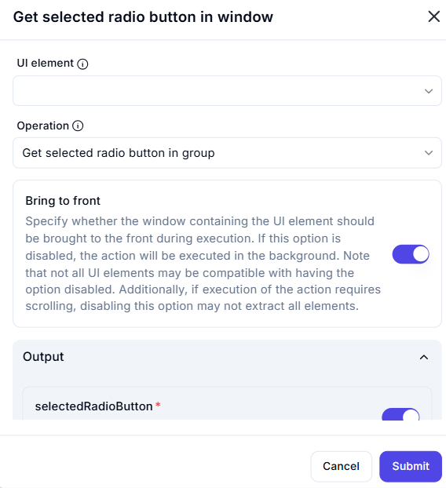

# Get Selected Radio Button in Window

## Description  

The **Get Selected Radio Button in Window** action retrieves the name of the currently selected radio button within a specified UI element.

## Fields and Options  

### **1. UI Element** *(Required)* 🛈  

- Select the **UI element** containing the radio button group.

### **2. Operation** *(Required)* 🛈  

- Choose the action to perform.
- Available option:  
  - **Get selected radio button in group** – Retrieves the name of the currently selected radio button.

### **3. Bring to Front** *(Optional)* 🛈  

- If enabled, the window containing the UI element will be brought to the front during execution.  
- If disabled, the action will run in the background.  
- Some UI elements may not be accessible if this option is turned off.  
- If scrolling is required for extraction, disabling this option may affect accuracy.

### **4. Output Variable** *(selectedRadioButton)*  

- Stores the name of the selected radio button in a variable.

## Use Cases  

- Extracting user selections from radio button groups for automation workflows.  
- Validating selected options in UI-based tests.  
- Capturing user input from application forms.

## Important Notes  

- Ensure the correct UI element is selected for accurate retrieval.  
- If radio buttons are dynamically loaded, ensure they are visible before execution.  
- Bringing the window to the front improves reliability but may disrupt user activity.

## Summary  

The **Get Selected Radio Button in Window** action allows users to extract the currently selected radio button's name, enabling automation of UI interactions and validation of user selections.
