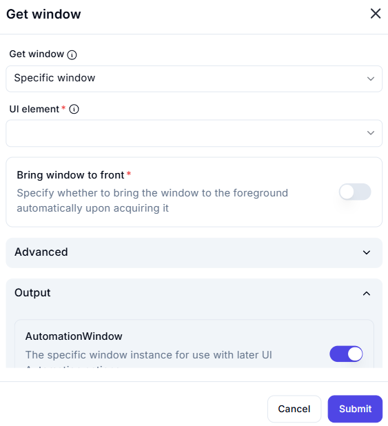

# Get Window  

## Description  

The **Get Window** action is used to acquire a specific application window for UI automation. It identifies a window based on a specified UI element and can optionally bring it to the front.  

  

## Fields and Options  

### **1. Get Window** *(Required)* 🛈

- Choose how to identify the window:  
  - **Specific window** – Targets a particular application window.  

### **2. UI Element** *(Required)* 🛈

- Select the **UI element** that identifies the window.  

### **3. Bring Window to Front** *(Optional)* 🛈

- Toggle this option to **bring the window to the foreground** upon acquisition.  

## **Advanced Options**

- Additional configurations for specific automation scenarios.  

## **Output**

- **AutomationWindow** – Stores the acquired window instance for use in later UI automation actions.  

## **Use Cases**

- Ensuring automation interacts with the correct application window.  
- Bringing an application window to the foreground if necessary.  
- Setting up window-based automation workflows.  

## **Important Notes**

- If the **Bring Window to Front** option is disabled, the window will be acquired but might remain in the background.  
- Ensure the selected UI element uniquely identifies the desired window.  

## **Summary**

The **Get Window** action is essential for interacting with specific application windows, providing precise control over UI automation.  
