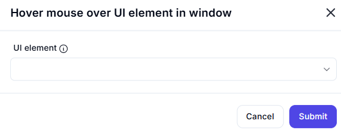

# Hover Mouse Over UI Element in Window  

## Description

This feature allows users to hover the mouse over a specific UI element within a window. It is useful for simulating user interactions or triggering tooltips and hover effects in applications.  

  

## Fields and Options  

### 1. **UI Element** 🛈

- **Description**: Specify the UI element over which to hover the mouse.  
- **Purpose**: This ensures the correct UI element is targeted for the hover action.  

## Use Cases

- **Tooltip Activation**: Simulating hover actions to trigger tooltips or pop-ups.  
- **UI Testing**: Testing hover effects or interactions in applications.  
- **Workflow Automation**: Integrating hover actions into larger automation workflows.  

## Summary

The **Hover Mouse Over UI Element in Window** action provides a way to simulate hovering the mouse over a specific UI element. It ensures accurate interaction with UI elements, making it ideal for testing and automation workflows.
