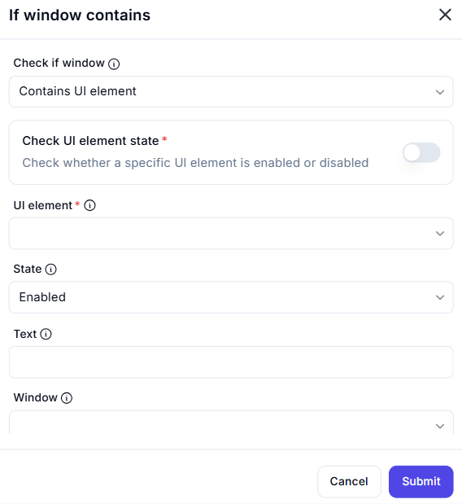

# If Window Contains  

## Description

This feature allows users to check if a specific window contains a UI element and verify its state (enabled or disabled). It is useful for implementing conditional logic in automation workflows based on the presence and state of UI elements.  

  

## Fields and Options  

### 1. **Check If Window** 🛈

- **Description**: Choose what to check in the window:  
  - **Contains UI Element**: Check if the window contains a specific UI element.  
- **Purpose**: This ensures the correct condition is evaluated.  

### 2. **Check UI Element State** 🛈

- **Description**: Specify whether to check the state of the UI element:  
  - **Enabled**: Check if the UI element is enabled.  
  - **Disabled**: Check if the UI element is disabled.  
- **Purpose**: This ensures the desired state of the UI element is verified.  

### 3. **UI Element** 🛈

- **Description**: Specify the UI element to check within the window.  
- **Purpose**: This ensures the correct UI element is targeted.  

### 4. **State** 🛈

- **Description**: Choose the state to check for the UI element:  
  - **Enabled**: Verify if the UI element is enabled.  
  - **Disabled**: Verify if the UI element is disabled.  
- **Purpose**: This ensures the desired state is checked.  

### 5. **Text** 🛈

- **Description**: Specify the text associated with the UI element (if applicable).  
- **Purpose**: This ensures the correct UI element is identified based on its text.  

### 6. **Window** 🛈

- **Description**: Specify the window to check for the UI element.  
- **Purpose**: This ensures the correct window is targeted.  

## Use Cases

- **Conditional Logic**: Implementing workflows that depend on the presence and state of UI elements.  
- **UI Testing**: Verifying the state of UI elements during testing or debugging.  
- **Workflow Automation**: Integrating UI element checks into larger automation workflows.  

## Summary

The **If Window Contains** action provides a way to check if a specific window contains a UI element and verify its state (enabled or disabled). It ensures reliable conditional logic in automation workflows, making it ideal for UI testing and workflow automation.
