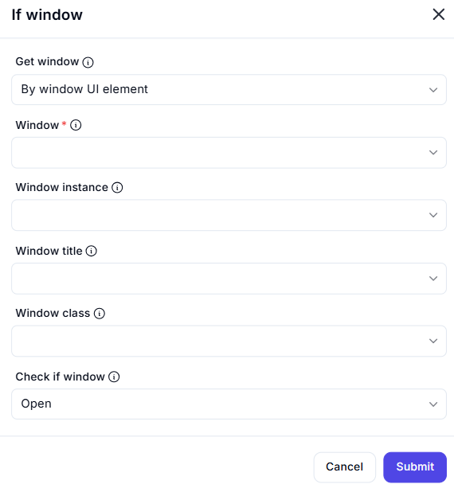

# If Window  

## Description

This feature allows users to check if a specific window is open by identifying it using various attributes such as UI element, title, or class. It is useful for implementing conditional logic in automation workflows based on the state of a window.  

  

## Fields and Options  

### 1. **Get Window** 🛈

- **Description**: Choose how to identify the window:  
  - **By Window UI Element**: Identify the window using its UI element.  
  - **By Window Title**: Identify the window using its title.  
  - **By Window Class**: Identify the window using its class.  
- **Purpose**: This ensures the correct window is targeted for the check.  

### 2. **Window** 🛈

- **Description**: Specify the window to check using one of the following:  
  - **Window Instance**: Select the window instance.  
  - **Window Title**: Enter the window title.  
  - **Window Class**: Enter the window class.  
- **Purpose**: This ensures the correct window is identified.  

### 3. **Check If Window** 🛈

- **Description**: Choose the condition to check:  
  - **Open**: Check if the window is open.  
- **Purpose**: This ensures the desired condition is evaluated.

## Use Cases

- **Conditional Logic**: Implementing workflows that depend on the state of a window (e.g., open or closed).  
- **Window Management**: Verifying if a window is open before performing further actions.  
- **Workflow Automation**: Integrating window state checks into larger automation workflows.  

## Summary

The **If Window** action provides a way to check if a specific window is open by identifying it using attributes like UI element, title, or class. It ensures reliable conditional logic in automation workflows, making it ideal for window management and workflow automation.
