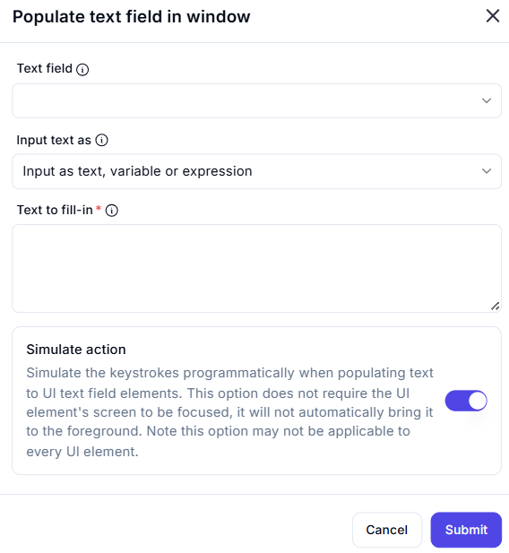

# Populate Text Field in Window  

## Description  

The **Populate Text Field in Window** action allows automation to enter text into a specified text field within an application window. It supports entering static text, variables, or expressions.  

  

## Fields and Options  

### **1. Text Field** *(Required)* 🛈

- Select the **text field** that will receive the text input.  

### **2. Input Text As** *(Required)* 🛈

- Choose the format for entering text:  
  - **Input as text, variable, or expression** *(Default)*  
  - **Input as secure text**  

### **3. Text to Fill-in** *(Required)* 🛈

- Enter the desired text, variable, or expression to be input into the selected text field.  

### **4. Simulate Action** *(Optional)* 🛈

- **Enabled:** Simulates keystrokes programmatically without bringing the UI to the foreground.  
- **Disabled:** Uses traditional input, which may require the UI to be active.  

## Use Cases  

- Auto-filling login credentials, forms, or search fields.  
- Automating data entry workflows in applications.  
- Populating UI elements with dynamic text using variables.  

## Important Notes  

- Not all UI elements support simulated keystrokes.  
- If simulation does not work, try focusing the text field first before populating it.  

## Summary  

The **Populate Text Field in Window** action is a powerful way to automate text input in applications, streamlining data entry and enhancing workflow automation.  
