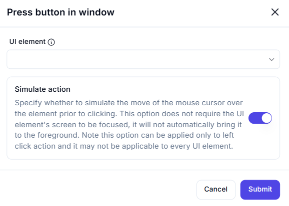

# Press Button in Window  

## Description  

The **Press Button in Window** action automates clicking a specified button within an application window. It supports simulating mouse movement before clicking and does not require the UI to be in focus.  

  

## Fields and Options  

### **1. UI Element** *(Required)* 🛈

- Select the **button** UI element that should be clicked.  

### **2. Simulate Action** *(Optional)* 🛈

- **Enabled:** Simulates mouse movement before clicking without requiring the UI to be active in the foreground.  
- **Disabled:** Performs a traditional click, which may require the UI to be focused.  

## Use Cases  

- Automating button clicks in application workflows.  
- Triggering actions like submitting forms, confirming dialogs, or navigating UI menus.  
- Running UI automation tasks that do not require manual user interaction.  

## Important Notes  

- The simulation option only applies to **left-click actions**.  
- Some UI elements may not support simulated clicks; in such cases, try bringing the window to the foreground first.  

## Summary  

The **Press Button in Window** action enables seamless UI automation by programmatically clicking buttons, improving workflow efficiency and reducing manual input.  
