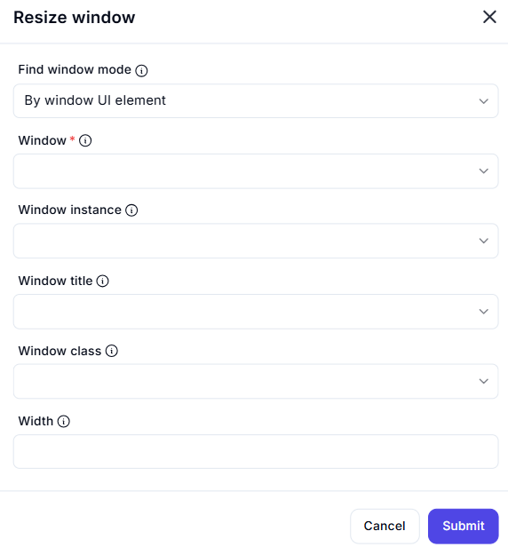

# Resize Window  

## Description

This feature allows users to resize a specific window by specifying its dimensions. It includes options to identify the window using various attributes such as UI element, title, or class.  

  

## Fields and Options  

### 1. **Find Window Mode** 🛈

- **Description**: Choose how to identify the window to resize:  
  - **By Window UI Element**: Identify the window using its UI element.  
  - **By Window Title**: Identify the window using its title.  
  - **By Window Class**: Identify the window using its class.  
- **Purpose**: This ensures the correct window is targeted for resizing.  

### 2. **Window** 🛈

- **Description**: Specify the window to resize using one of the following:  
  - **Window Instance**: Select the window instance.  
  - **Window Title**: Enter the window title.  
  - **Window Class**: Enter the window class.  
- **Purpose**: This ensures the correct window is identified.  

### 3. **Width** 🛈

- **Description**: Specify the new width for the window (in pixels).  
- **Purpose**: This ensures the window is resized to the desired width.  

### 4. **Height** 🛈

- **Description**: Specify the new height for the window (in pixels).  
- **Purpose**: This ensures the window is resized to the desired height. 

## Use Cases

- **Window Management**: Resizing windows for better screen organization.  
- **Workflow Automation**: Automating window resizing as part of larger workflows.  
- **UI Testing**: Resizing windows during UI testing or debugging.  

## Summary

The **Resize Window** action provides a way to resize a specific window by specifying its dimensions. It ensures precise window management, making it ideal for automation workflows involving window manipulation.  