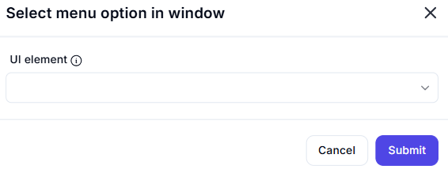

# Select Menu Option in Window  

## Description

This feature allows users to select a menu option within a window by specifying the UI element. It is useful for automating tasks that involve interacting with menus in applications.  

  

## Fields and Options  

### 1. **UI Element** 🛈

- **Description**: Specify the menu option (UI element) to select within the window.  
- **Purpose**: This ensures the correct menu option is targeted for selection.

## Use Cases

- **Menu Navigation**: Automating the process of selecting options from menus in applications.  
- **Workflow Automation**: Integrating menu interactions into larger automation workflows.  
- **UI Testing**: Testing or debugging menu functionality in applications.  

## Summary

The **Select Menu Option in Window** action provides a way to select a specific menu option within a window. It ensures precise menu interaction, making it ideal for automation workflows involving menu navigation.
