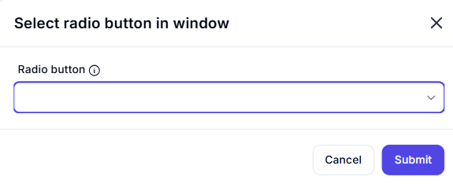

# Select Radio Button in Window  

## Description  

The **Select Radio Button in Window** action allows automation to select a specified radio button within an application window.  

  

## Fields and Options  

### **1. Radio Button** *(Required)* 🛈

- Select the **radio button** UI element that should be selected.  

## Use Cases  

- Automating selection in forms and settings dialogs.  
- Ensuring a predefined option is always chosen in a workflow.  
- Reducing manual interaction in repetitive UI tasks.  

## Important Notes  

- This action requires the radio button to be **visible** and **interactable** within the application UI.  
- Ensure the correct UI element is selected to avoid unintended selections.  

## Summary  

The **Select Radio Button in Window** action simplifies UI automation by programmatically selecting a radio button, improving efficiency and accuracy in automated workflows.  
