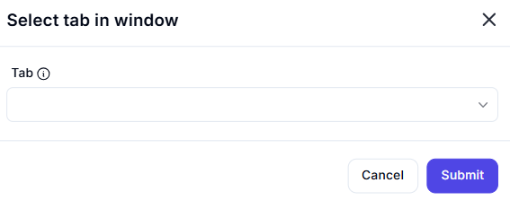

# Select Tab in Window  

## Description

This feature allows users to select a specific tab within a window. It is useful for automating tasks that involve switching between tabs in applications like web browsers or multi-tab interfaces.  

  

## Fields and Options  

### 1. **Tab** 🛈

- **Description**: Specify the tab to select within the window.  
- **Purpose**: This ensures the correct tab is targeted for selection.

## Use Cases

- **Tab Switching**: Automating the process of switching between tabs in a multi-tab interface.  
- **Workflow Automation**: Integrating tab selection into larger automation workflows.  
- **UI Testing**: Testing or debugging applications with multiple tabs.  

## Summary

The **Select Tab in Window** action provides a way to select a specific tab within a window. It ensures precise tab management, making it ideal for automation workflows involving multi-tab applications.
