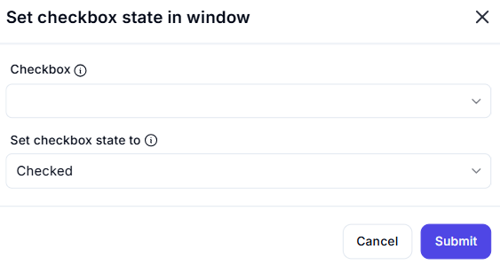

# Set Checkbox State in Window  

## Description  

The **Set Checkbox State in Window** action allows automation to select or deselect a checkbox in an application window.  

  

## Fields and Options  

### **1. Checkbox** *(Required)* 🛈

- Select the **checkbox UI element** that should be modified.  

### **2. Set Checkbox State To** *(Required)* 🛈

- Choose between:  
  - **Checked** – Ensures the checkbox is selected.  
  - **Unchecked** – Ensures the checkbox is deselected.  

## Use Cases  

- Automating the enabling or disabling of settings.  
- Ensuring predefined preferences in forms and dialogs.  
- Reducing manual interaction in repetitive UI tasks.  

## Important Notes  

- The checkbox must be **visible** and **interactable** within the application UI.  
- Ensure the correct UI element is selected to avoid unintended state changes.  

## Summary  

The **Set Checkbox State in Window** action streamlines UI automation by programmatically checking or unchecking a checkbox, enhancing workflow efficiency and accuracy.  
