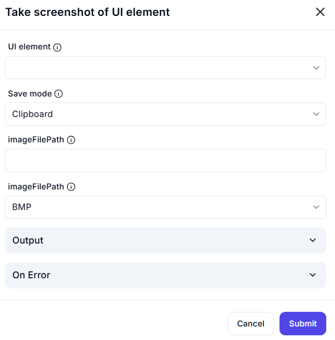

# Take Screenshot of UI Element  

## Description  

The **Take Screenshot of UI Element** action captures a screenshot of a specific UI element and saves it to a designated location or the clipboard.

## Fields and Options  

### **1. UI Element** *(Required)* 🛈  

- Select the **UI element** you want to capture in the screenshot.

### **2. Save Mode** *(Required)* 🛈  

- Choose where to save the screenshot.  
- Available options:  
  - **Clipboard** – Copies the screenshot to the clipboard.  
  - **File** – Saves the screenshot as an image file.

### **3. Image File Path** *(Required if Save Mode is File)* 🛈  

- Specify the full path where the image file should be saved.  
- Example: `C:\Users\Username\Desktop\screenshot.bmp`

### **4. Image Format** *(Required)* 🛈  

- Select the format for the screenshot image.  
- Available options:  
  - **BMP** (Bitmap)  
  - **JPG** (JPEG)  
  - **PNG** (Portable Network Graphics)  
  - **GIF** (Graphics Interchange Format)

### **5. Output**  

- Stores the result of the screenshot operation.

### **6. On Error**  

- Define the action to take if an error occurs during execution.

## Use Cases  

- Capturing UI elements for documentation or debugging.  
- Extracting images of UI components for automated reports.  
- Storing UI snapshots for visual testing and verification.

## Important Notes  

- Ensure the UI element is visible and accessible before capturing.  
- If using the clipboard save mode, the screenshot will replace any existing clipboard contents.  
- When saving to a file, make sure the specified directory exists.

## Summary  

The **Take Screenshot of UI Element** action allows users to capture specific UI elements and store them as images or clipboard data, aiding in automation, testing, and documentation workflows.
