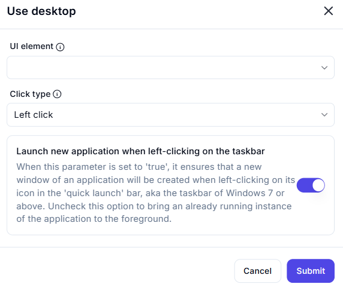

# Use Desktop  

## Description

This feature allows users to interact with UI elements on the desktop, such as clicking on taskbar icons. It includes options to control the click type and behavior when interacting with the taskbar.  

  

## Fields and Options  

### 1. **UI Element** 🛈

- **Description**: Specify the UI element on the desktop to interact with (e.g., taskbar icon).  
- **Purpose**: This ensures the correct UI element is targeted.  

### 2. **Click Type** 🛈

- **Description**: Choose the type of click to perform:  
  - **Left Click**: Perform a standard left-click.  
  - **Right Click**: Perform a right-click (if needed for context menus).  
  - **Double Click**: Perform a double-click (if required for specific actions).  
- **Purpose**: This ensures the desired click type is performed.  

### 3. **Launch New Application When Left-Clicking on the Taskbar** 🛈

- **Description**: Specify the behavior when left-clicking on a taskbar icon:  
  - **Enabled**: Launch a new instance of the application if it is not already running.  
  - **Disabled**: Bring an already running instance of the application to the foreground.  
- **Purpose**: This controls whether a new instance is launched or an existing one is brought to the foreground.

## Use Cases

- **Taskbar Interaction**: Clicking on taskbar icons to launch or switch applications.  
- **Desktop Automation**: Automating interactions with desktop UI elements.  
- **Workflow Integration**: Integrating desktop interactions into larger automation workflows.  

## Summary

The **Use Desktop** action provides a way to interact with UI elements on the desktop, such as taskbar icons, with options to control the click type and behavior. It ensures precise and flexible desktop automation, making it ideal for workflows involving desktop interactions.
