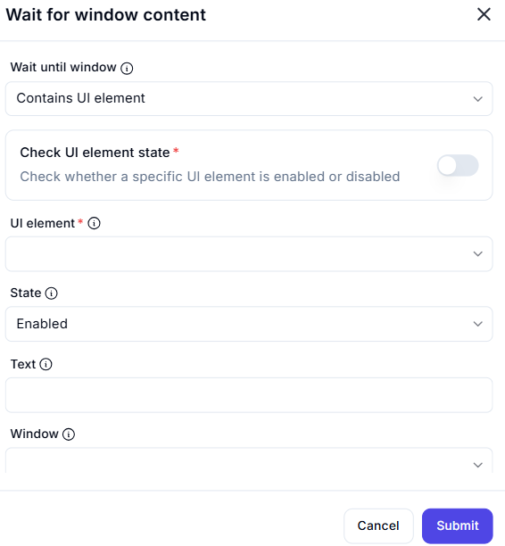

# Wait for Window Content  

## Description

This feature allows users to wait until a specific window contains a UI element and verify its state (enabled or disabled). It is useful for synchronizing automation workflows with the appearance and state of UI elements in a window.  

  

## Fields and Options  

### 1. **Wait Until Window** 🛈

- **Description**: Choose what to wait for in the window:  
  - **Contains UI Element**: Wait until the window contains a specific UI element.  
- **Purpose**: This ensures the correct condition is monitored.  

### 2. **Check UI Element State** 🛈

- **Description**: Specify whether to check the state of the UI element:  
  - **Enabled**: Wait until the UI element is enabled.  
  - **Disabled**: Wait until the UI element is disabled.  
- **Purpose**: This ensures the desired state of the UI element is verified.  

### 3. **UI Element** 🛈

- **Description**: Specify the UI element to wait for within the window.  
- **Purpose**: This ensures the correct UI element is targeted.  

### 4. **State** 🛈

- **Description**: Choose the state to wait for the UI element:  
  - **Enabled**: Wait until the UI element is enabled.  
  - **Disabled**: Wait until the UI element is disabled.  
- **Purpose**: This ensures the desired state is monitored.  

### 5. **Text** 🛈

- **Description**: Specify the text associated with the UI element (if applicable).  
- **Purpose**: This ensures the correct UI element is identified based on its text.  

### 6. **Window** 🛈

- **Description**: Specify the window to monitor for the UI element.  
- **Purpose**: This ensures the correct window is targeted.  

## Use Cases

- **Synchronization**: Waiting for a UI element to appear or change state before proceeding with the workflow.  
- **UI Testing**: Verifying the state of UI elements during testing or debugging.  
- **Workflow Automation**: Integrating UI element checks into larger automation workflows.  

## Summary

The **Wait for Window Content** action provides a way to wait until a specific window contains a UI element and verify its state (enabled or disabled). It ensures reliable synchronization with UI elements, making it ideal for automation workflows involving window interactions.
