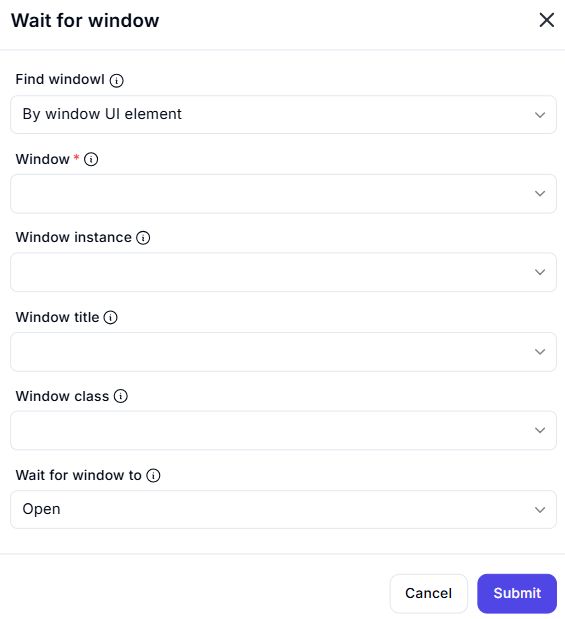

# Wait for Window  

## Description

This feature allows users to wait for a specific window to open by identifying it using various attributes such as UI element, title, or class. It is useful for synchronizing automation workflows with the appearance of a window.  

  

## Fields and Options  

### 1. **Find Window** 🛈

- **Description**: Choose how to identify the window:  
  - **By Window UI Element**: Identify the window using its UI element.  
  - **By Window Title**: Identify the window using its title.  
  - **By Window Class**: Identify the window using its class.  
- **Purpose**: This ensures the correct window is targeted for waiting.  

### 2. **Window** 🛈

- **Description**: Specify the window to wait for using one of the following:  
  - **Window Instance**: Select the window instance.  
  - **Window Title**: Enter the window title.  
  - **Window Class**: Enter the window class.  
- **Purpose**: This ensures the correct window is identified.  

### 3. **Wait for Window To** 🛈

- **Description**: Choose the condition to wait for:  
  - **Open**: Wait until the window is open.  
- **Purpose**: This ensures the desired condition is monitored.

## Use Cases

- **Synchronization**: Waiting for a window to open before proceeding with the workflow.  
- **Workflow Automation**: Integrating window state checks into larger automation workflows.  
- **UI Testing**: Testing or debugging applications that involve window interactions.  

## Summary

The **Wait for Window** action provides a way to wait for a specific window to open by identifying it using attributes like UI element, title, or class. It ensures reliable synchronization with window states, making it ideal for automation workflows involving window interactions.
