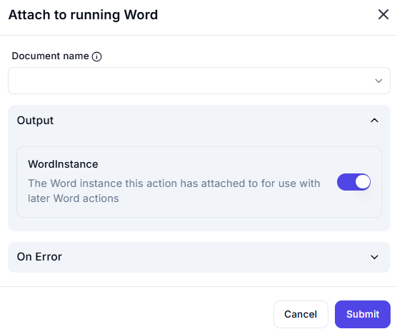

# Attach to Running Word  

## Description

This feature allows users to attach to an already running instance of Microsoft Word. It is useful for interacting with open Word documents without launching a new instance.  

  

## Fields and Options  

### 1. **Document Name** 🛈  

- **Description**: Specify the name of the open Word document to attach to.  
- **Purpose**: This ensures the correct document is selected for interaction.  

### 2. **Output: WordInstance** 🛈

- **Description**: Retrieves the Word instance that this action has attached to.  
- **Purpose**: This allows the attached Word instance to be used in subsequent Word actions.  

### 3. **On Error**  

- **Description**: Define how errors should be handled during execution (e.g., fail, retry, ignore).  
- **Purpose**: This ensures proper error handling in case the attachment fails.  
 
## Use Cases  

- **Automating Tasks**: Attaching to an open Word document for further automation tasks.  
- **Avoiding Multiple Instances**: Reusing an existing Word instance instead of launching a new one.  
- **Workflow Integration**: Integrating Word document handling into larger workflows.  

## Summary  

The **Attach to Running Word** action provides a way to attach to an already running instance of Microsoft Word. It ensures efficient interaction with open Word documents, making it ideal for automation workflows involving Word.
