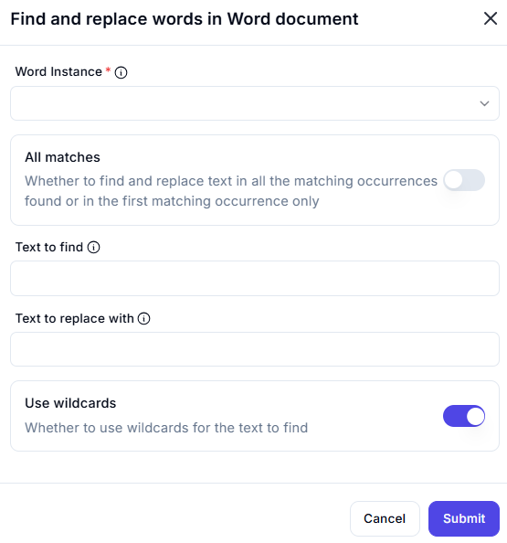

# Find and Replace Words in Word Document  

## Description

This feature allows users to find and replace text in a Word document. It includes options to replace all matching occurrences or just the first one, and supports the use of wildcards for advanced text searching.  

  

## Fields and Options  

### 1. **All Matches** 🛈

- **Description**: Choose whether to replace text in all matching occurrences or only the first one:  
  - **Enabled**: Replace text in all matching occurrences.  
  - **Disabled**: Replace text in the first matching occurrence only.  
- **Purpose**: This ensures the desired scope of replacement is applied.  

### 2. **Text to Find** 🛈

- **Description**: Enter the text to find in the document.  
- **Purpose**: This ensures the correct text is identified for replacement.  

### 3. **Text to Replace With** 🛈

- **Description**: Enter the text to replace the found text with.  
- **Purpose**: This ensures the correct replacement text is used.  

### 4. **Use Wildcards** 🛈

- **Description**: Specify whether to use wildcards for the text to find:  
  - **Enabled**: Use wildcards for advanced text searching (e.g., `*` for multiple characters).  
  - **Disabled**: Perform a standard text search without wildcards.  
- **Purpose**: This allows for flexible and advanced text searching.  

## Use Cases

- **Text Replacement**: Replacing specific words or phrases in a document.  
- **Bulk Editing**: Replacing text in all matching occurrences for bulk updates.  
- **Advanced Searching**: Using wildcards for complex text search patterns.  

## Summary

The **Find and Replace Words in Word Document** action provides a way to find and replace text in a Word document with customizable options like replacing all matches or using wildcards. It ensures precise and flexible text editing, making it ideal for document automation and bulk updates.
