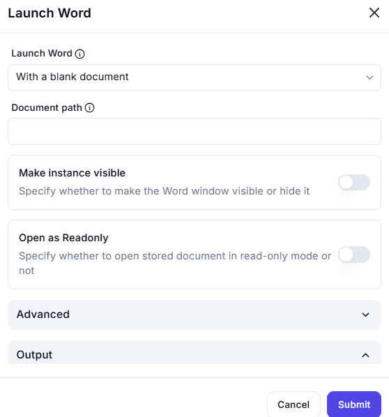

# Launch Word  

## Description

This feature allows users to launch Microsoft Word, either with a blank document or by opening an existing document. It includes options to control visibility, read-only mode, and advanced settings.  

  

## Fields and Options  

### 1. **Launch Word** 🛈

- **Description**: Choose how to launch Microsoft Word:  
  - **With a blank document**: Open Word with a new, blank document.  
  - **Document path**: Open Word with an existing document by specifying its file path.  
- **Purpose**: This ensures Word is launched with the desired document or a blank file.  

### 2. **Make Instance Visible** 🛈

- **Description**: Specify whether to make the Word window visible or hide it.  
  - **Enabled**: Make the Word window visible.  
  - **Disabled**: Hide the Word window.  
- **Purpose**: This controls the visibility of the Word instance during automation.  

### 3. **Open as Readonly** 🛈

- **Description**: Specify whether to open the document in read-only mode.  
  - **Enabled**: Open the document in read-only mode.  
  - **Disabled**: Open the document in editable mode.  
- **Purpose**: This ensures the document is opened with the appropriate permissions.  

### 4. **Advanced** 🛈  

- **Description**: Configure additional settings for launching Word (e.g., macros, templates).  
- **Purpose**: This allows for advanced customization of the Word instance.  

### 5. **Output** 🛈  

- **Description**: Retrieve the Word instance or document object for further use in the workflow.  
- **Purpose**: This ensures the Word instance or document can be used in subsequent actions.  

## Use Cases  

- **Document Creation**: Launching Word with a blank document for creating new files.  
- **Document Editing**: Opening existing documents for editing or processing.  
- **Workflow Automation**: Integrating Word launch into larger automation workflows.  

## Summary  

The **Launch Word** action provides a way to launch Microsoft Word with customizable options like document path, visibility, read-only mode, and advanced settings. It ensures seamless integration of Word into automation workflows, enabling efficient document handling and processing.
