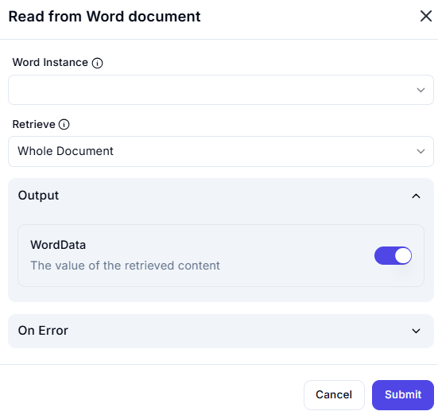

# Read from Word Document  

## Description

This feature allows users to retrieve content from a Word document, such as the entire document or specific sections. It is useful for extracting text or data from Word documents for further processing or analysis.  

  

## Fields and Options  

### 1. **Word Instance** 🛈

- **Description**: Select the Word instance (document) from which to retrieve content.  
- **Purpose**: This ensures the action is performed on the correct document.  

### 2. **Retrieve** 🛈

- **Description**: Choose what to retrieve from the document:  
  - **Whole Document**: Retrieve the entire content of the document.  
  - **Specific Section**: Retrieve a specific section or range of the document.  
- **Purpose**: This ensures the desired content is retrieved.  

### 3. **Output: WordData** 🛈

- **Description**: Retrieves the value of the retrieved content (e.g., text, data).  
- **Purpose**: This provides the extracted content for further use in the workflow.  

### 4. **On Error**

- **Description**: Define how errors should be handled during execution (e.g., fail, retry, ignore).  
- **Purpose**: This ensures proper error handling in case the retrieval fails.  

## Use Cases

- **Text Extraction**: Extracting text from Word documents for analysis or processing.  
- **Data Retrieval**: Retrieving specific sections of a document for further use.  
- **Workflow Automation**: Integrating document content retrieval into larger workflows.  

## Summary

The **Read from Word Document** action provides a way to retrieve content from a Word document, such as the entire document or specific sections. It ensures accurate extraction of text or data, making it ideal for automation workflows involving Word documents.
