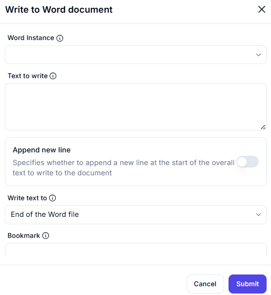

# Write to Word Document  

## Description

This feature allows users to write text to a Word document at a specified location, such as the end of the document or a specific bookmark. It includes options to append a new line before writing the text.  

  

## Fields and Options  

### 1. **Word Instance** 🛈

- **Description**: Select the Word instance (document) where the text will be written.  
- **Purpose**: This ensures the action is performed on the correct document.  

### 2. **Text to Write** 🛈

- **Description**: Enter the text to write to the document.  
- **Purpose**: This ensures the desired text is added to the document.  

### 3. **Append New Line** 🛈

- **Description**: Specify whether to append a new line at the start of the text being written.  
  - **Enabled**: Add a new line before writing the text.  
  - **Disabled**: Write the text without adding a new line.  
- **Purpose**: This controls the formatting of the text being added.  

### 4. **Write Text To** 🛈

- **Description**: Choose where to write the text in the document:  
  - **End of the Word File**: Append the text to the end of the document.  
  - **Bookmark**: Write the text at a specific bookmark in the document.  
- **Purpose**: This ensures the text is written at the desired location.  

### 5. **Bookmark** 🛈

- **Description**: Specify the bookmark where the text should be written (if applicable).  
- **Purpose**: This ensures the text is written at the correct bookmark location.  

## Use Cases

- **Document Editing**: Adding text to a Word document at a specific location.  
- **Appending Content**: Appending text to the end of a document.  
- **Bookmark Integration**: Writing text at a predefined bookmark for structured document updates.  

## Summary

The **Write to Word Document** action provides a way to write text to a Word document at a specified location, such as the end of the document or a bookmark. It includes options to control formatting and ensures precise text placement, making it ideal for document editing and automation workflows.
