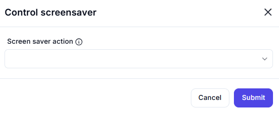

# Control Screensaver  

## Description

This feature allows users to control the screensaver, such as enabling, disabling, or activating it. It is useful for managing system behavior during automation workflows.  

  

## Fields and Options  

### 1. **Screen Saver Action** 🛈

- **Description**: Choose the action to perform on the screensaver:  
  - **Enable**: Turn on the screensaver.  
  - **Disable**: Turn off the screensaver.  
  - **Activate**: Immediately activate the screensaver.  
- **Purpose**: This ensures the desired screensaver action is performed.  

## Use Cases

- **System Management**: Enabling or disabling the screensaver during automation tasks.  
- **Security**: Activating the screensaver to lock the system when not in use.  
- **Workflow Integration**: Including screensaver control as part of larger automation workflows.  

## Summary

The **Control Screensaver** action provides a way to manage the screensaver, including enabling, disabling, or activating it. It ensures proper system behavior and security during automation workflows.
