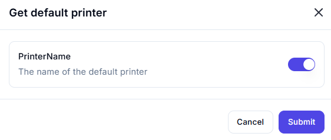

# Get Default Printer  

## Description

This feature allows users to retrieve the name of the default printer configured on the system. It is useful for automation workflows that require printing or printer-related tasks.  

  

## Fields and Options  

### 1. **PrinterName** 🛈

- **Description**: Retrieves the name of the default printer.  
- **Purpose**: This ensures the correct printer is identified for printing tasks.  

## Use Cases  

- **Printing Automation**: Identifying the default printer for automated printing tasks.  
- **Printer Configuration**: Using the default printer name in workflows that require printer settings.  
- **Workflow Integration**: Including printer information as part of larger automation workflows.  

## Summary

The **Get Default Printer** action provides a way to retrieve the name of the default printer. It ensures accurate identification of the printer, making it essential for workflows involving printing or printer configuration.
