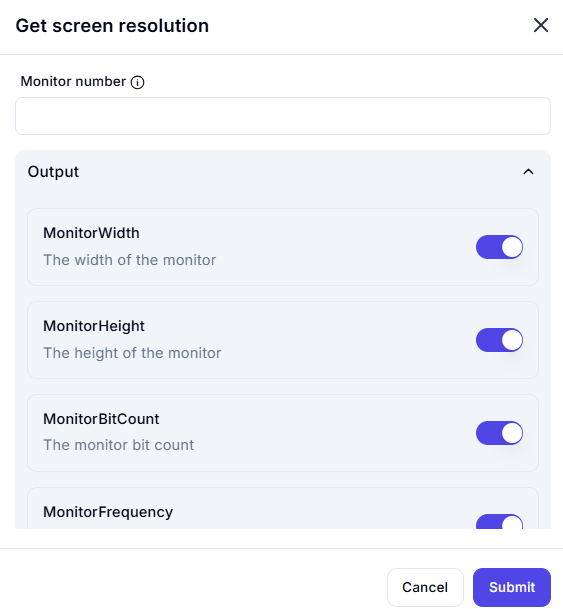

# Get Screen Resolution  

## Description

This feature allows users to retrieve the resolution and display settings of a specific monitor. It is useful for workflows that require information about screen dimensions, bit count, or refresh rate.  

  

## Fields and Options  

### 1. **Monitor Number** 🛈

- **Description**: Specify the monitor number for which to retrieve the resolution.  
- **Purpose**: This ensures the correct monitor is selected for retrieving resolution details.  

### 2. **Output**

- **MonitorWidth**: Retrieves the width of the monitor in pixels.  
- **MonitorHeight**: Retrieves the height of the monitor in pixels.  
- **MonitorBitCount**: Retrieves the color depth (bit count) of the monitor.  
- **MonitorFrequency**: Retrieves the refresh rate (frequency) of the monitor in Hz.  

## Use Cases

- **Screen Configuration**: Retrieving monitor resolution for configuring display settings.  
- **Workflow Adaptation**: Adjusting workflows based on screen dimensions or display capabilities.  
- **Debugging**: Gathering monitor information for troubleshooting display-related issues.  

## Summary

The **Get Screen Resolution** action provides a way to retrieve the resolution, bit count, and refresh rate of a specific monitor. It ensures accurate information about display settings, making it ideal for workflows involving screen configuration or adaptation.
