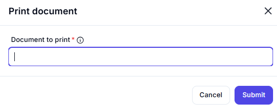

# Print Document  

## Description

This feature allows users to print a specified document. It is useful for automating document printing tasks in workflows.  

  

## Fields and Options  

### 1. **Document to Print** 🛈

- **Description**: Specify the document to print.  
- **Purpose**: This ensures the correct document is selected for printing.  

## Use Cases

- **Automating Printing Tasks**: Printing documents as part of an automated workflow.  
- **Batch Printing**: Printing multiple documents in sequence.  
- **Workflow Integration**: Including document printing as a step in larger workflows.  

## Summary

The **Print Document** action provides a way to print a specified document. It ensures seamless integration of printing tasks into automation workflows, improving efficiency and reducing manual effort.
