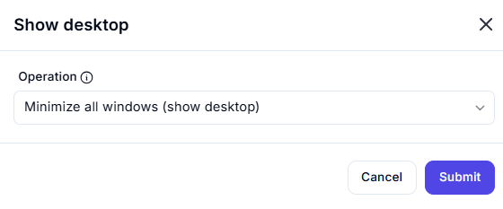

# Show Desktop  

## Description

This feature allows users to minimize all open windows and show the desktop. It is useful for quickly accessing the desktop or resetting the workspace during automation workflows.  

  

## Fields and Options  

### 1. **Operation** 🛈

- **Description**: Choose the operation to perform.  
  - **Minimize all windows (show desktop)**: Minimizes all open windows to show the desktop.
  - **Restore all windows(undo show desktop)**:
  Restores all minimised windows to undo show desktop  
- **Purpose**: This ensures the desired action is performed on the system.  

## Use Cases  

- **Quick Desktop Access**: Minimizing all windows to quickly access the desktop.  
- **Workspace Reset**: Resetting the workspace by minimizing all open windows.  
- **Automation Workflows**: Including desktop access as part of larger automation tasks.  

## Summary

The **Show Desktop** action provides a way to minimize all open windows and show the desktop. It ensures quick access to the desktop and helps in resetting the workspace during automation workflows.
