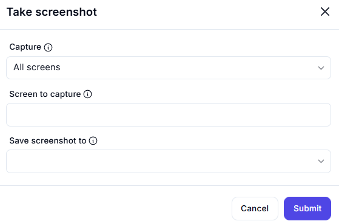

# Take Screenshot  

## Description

This feature allows users to capture a screenshot of the screen or a specific screen area. It is useful for documenting workflows, debugging, or capturing visual data.  

  

## Fields and Options  

### 1. **Capture** 🛈

- **Description**: Choose what to capture:  
  - **All Screens**: Capture the entire screen.  
  - **Specific Screen**: Capture a specific screen or monitor.  
- **Purpose**: This ensures the correct screen area is captured.  

### 2. **Screen to Capture** 🛈

- **Description**: Specify the screen or monitor to capture (if selecting a specific screen).  
- **Purpose**: This ensures the desired screen is captured.  

### 3. **Save Screenshot To** 🛈

- **Description**: Choose where to save the screenshot:  
  - **Clipboard**: Save the screenshot to the clipboard for quick pasting.  
  - **File**: Save the screenshot as an image file.  
- **Purpose**: This ensures the screenshot is saved in the desired location.  

## Use Cases

- **Documentation**: Capturing screenshots for workflow documentation.  
- **Debugging**: Taking screenshots to debug issues in automation workflows.  
- **Visual Data Capture**: Saving visual data for analysis or reporting.  

## Summary  

The **Take Screenshot** action provides a way to capture screenshots of the entire screen or specific screens. It ensures accurate and flexible screenshot capture, making it ideal for documentation, debugging, and data capture in automation workflows.
