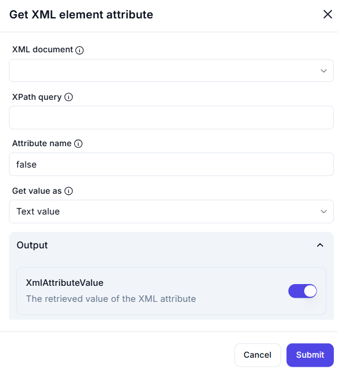

# Get XML Element Attribute

## Description

The **Get XML Element Attribute** action retrieves the value of a specified attribute from an XML document using an XPath query.



## Fields and Options  

### **1. XML Document** *(Required)* 🛈

- Select the XML document variable from which the attribute should be extracted.

### **2. XPath Query** *(Required)* 🛈  

- Specify the **XPath query** to locate the XML element containing the attribute.
- Example:  

  ```xpath
  /bookstore/book[@category='fiction']
  
This selects <book> elements where the category attribute is "fiction".

### **3. Attribute Name (Required)** 🛈

The name of the attribute whose value should be retrieved.

Example: If the XML contains <book title="XML Guide">, specifying title will return "XML Guide".

### **4. Get Value As (Required)** 🛈

Determines how the attribute value is retrieved:
Text value (Default): Returns the value as a string.
Number: Converts the value into a numeric format.
Boolean: Converts "true" or "false" values into a boolean type.

### **5. Output Variable** 🛈

Stores the retrieved attribute value in a variable (XmlAttributeValue).

## Use Cases

Extracting metadata from XML-based documents.
Retrieving configuration settings from XML files.
Parsing structured data for automation workflows.

## Important Notes

Ensure the XPath query correctly identifies the element.
If the attribute does not exist, the output may be empty or cause an error.
Boolean conversion applies only to "true"/"false" values.

## Summary

The Get XML Element Attribute action allows precise extraction of attribute values from XML data using XPath, making it useful for automation workflows involving XML processing