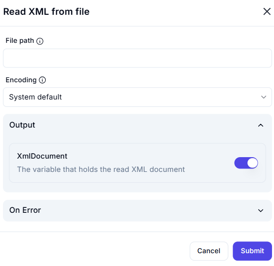

# Read XML from File

## Description

The **Read XML from File** action reads an XML document from a specified file path and stores its contents in a variable.

## Fields and Options  

### **1. File Path** *(Required)* 🛈

- The absolute or relative path of the XML file to be read.

### **2. Encoding** *(Optional)* 🛈

- Defines the character encoding used to read the file.  
- Default: **System Default**  
- Other options may include UTF-8, ASCII, or other supported encodings.

### **3. Output**

- **XmlDocument** *(Enabled by default)*  
  - Stores the parsed XML data as an XML document variable.

### **4. On Error** *(Optional)*

- Defines the behavior in case of errors, such as file not found or invalid XML format.

## Use Cases

- Parsing XML configuration files for automation workflows.
- Extracting structured data from XML documents.
- Processing XML-based API responses stored in local files.

## Important Notes

- Ensure the XML file exists at the specified path before executing this action.
- If the file contains malformed XML, the action may fail or throw an error.
- Encoding should match the file's actual encoding to prevent character misinterpretation.

## Summary

The **Read XML from File** action allows automation workflows to read and process XML data efficiently by loading it into a structured XML document variable.
